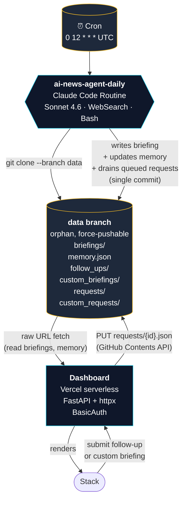

# ai-news-agent-routines

A daily AI-news briefing agent rebuilt on **Claude Code Routines**, with state on a **GitHub orphan branch** and a **Vercel-hosted dashboard** as the read surface. **$0 marginal LLM cost** — runs on the bundled quota of an existing Claude Max subscription.

This is the Routines edition of [`ai-news-agent`](https://github.com/emstacho-su/ai-news-agent) (v1). Same product (daily briefing, follow-up Q&A, custom briefings, persistent topic memory). Different runtime: every Anthropic-API call from v1 is replaced with a Routine that runs on Anthropic's cloud.

**Live:** https://ai-news-agent-routines.vercel.app *(basic-auth gated)*

---

## Why two repos

- **v1** is the *"I built an agent loop by hand"* portfolio piece: hand-rolled tool dispatch, in-process FastAPI scheduler, Anthropic SDK, Fly persistent volume.
- **v1-routines** (this repo) is the *"I rebuilt it on managed primitives once I understood it"* piece: a self-contained YAML-style prompt installed on a managed routine, the routine writes to a GitHub orphan branch, the dashboard reads from there.

Both ship. v1 stays deployed as the educational reference for the agent loop.

---

## Architecture



**One routine fires per day.** It generates the briefing, updates memory (so tomorrow's run can mark recurring stories as `[UPDATE]` instead of repeating them), drains up to 5 queued requests in the same session, then commits everything to the data branch in a single push. The dashboard is read-only against the data branch except for queueing requests, which it writes via the GitHub Contents API.

---

## What's actually inside

```
.
├── api/
│   └── index.py              # Vercel serverless entrypoint (re-exports FastAPI app)
├── routines/
│   ├── daily.prompt.md       # source of truth for the daily routine prompt
│   └── processor.prompt.md   # retired processor design (kept for reference)
├── dashboard.py              # FastAPI dashboard (~600 lines)
├── config.py                 # env-driven configuration
├── profile.py                # legacy profile loader (unused on Vercel)
├── prompts/                  # v1's prompt library (referenced by daily.prompt.md)
├── static/                   # vanilla HTML/CSS/JS — terminal/CRT aesthetic
├── tests/                    # pytest + respx (18 tests)
├── docs/
│   ├── routines-version-plan.md   # original planning doc (preserved as historical)
│   ├── r1-deviations.md           # corrections to the planning doc, post-build
│   └── request-schemas.md         # dashboard ↔ routine request file contract
├── vercel.json               # serverless routes
├── pyproject.toml            # deps live here (Vercel reads pyproject)
├── CLAUDE.md                 # operating rules for Claude Code in this repo
├── BUILD_ORDER.md            # phased build log (R0–R9)
└── SPEC.md                   # pointer to the planning doc
```

---

## Build phases

| Phase | Scope | Status |
|---|---|---|
| **R0** | Repo bootstrap, copy assets from v1 | done |
| **R1** | Create routines on Max plan; map actual API surface | done |
| **R2** | ~~Resend MCP server~~ — deleted; Gmail connector replaces, then dropped entirely | n/a |
| **R3** | Daily routine end-to-end + Claude GitHub App for write creds | done |
| **R4** | ~~Hourly processor routine~~ — built then retired post-R7 due to quota cap | retired |
| **R5** | ~~Custom routine~~ — merged into processor in R1 deviations | n/a |
| **R6** | Dashboard refactor (~50KB → 16KB) | done |
| **R7** | Vercel deploy | done |
| **R8** | Cutover (disable v1 APScheduler) | gated on stability |
| **R9** | Polish — README, learning notes, cross-links | done |

The phased plan as originally drafted is in [`docs/routines-version-plan.md`](./docs/routines-version-plan.md). Where reality diverged from the plan (and there were real divergences), the corrections are in [`docs/r1-deviations.md`](./docs/r1-deviations.md). Read both side by side for the design archaeology.

---

## Cost model

| Item | v1 (Anthropic API) | v1-routines (Max plan) |
|---|---|---|
| Daily run | ~$0.92 | $0 marginal |
| Follow-up Q&A | ~$0.05–0.15/click | $0 marginal |
| Custom briefing | ~$0.50–1.00 | $0 marginal |
| Monthly LLM total | ~$28–35 | $0 (within Max quota) |
| Hosting | Fly always-on (~$1.94/mo) | Vercel free tier ($0) |
| **Total monthly** | **~$30–37** | **~$0** |

Annualized savings: ~$340/year, on a Max subscription Stack pays for anyway.

The trade is operational latency: follow-up + custom briefing requests are queued and answered as part of the next morning's daily run (up to 24-hour wait). For a personal-use briefing agent that's an acceptable tradeoff. See [`docs/learning-notes.md`](./docs/learning-notes.md) for why the queue isn't drained more often.

---

## Daily flow as a user

1. **12:00 UTC daily** — the routine fires automatically. Reads memory.json from the data branch, runs WebSearches, classifies stories as `[NEW]` or `[UPDATE]`, writes today's briefing to `briefings/{date}.md`, updates memory, drains any queued follow-ups or custom briefings, commits and pushes — all in one session, ~7-12 minutes wall-clock.

2. **Stack opens https://ai-news-agent-routines.vercel.app** at his leisure. Briefing list loads from the data branch (CDN-cached raw URLs). Click a date → rendered markdown in the terminal/CRT aesthetic.

3. **(Optional) Stack clicks ASK on a briefing item** → types a follow-up question → dashboard PUTs a `requests/{id}.json` file to the data branch via the GitHub Contents API. The browser polls `/follow-up/{id}/status` every 5 minutes; the response file lands during the next morning's daily run.

4. **(Optional) Stack opens /custom** → submits a focus area ("Quantum cryptography this month") → dashboard PUTs a `custom_requests/{id}.json` file. Same polling shape; response lands as `custom_briefings/{date}_{slug}.md` next morning.

---

## Educational arc

This project pair is one developer's notebook on a single migration. The hand-rolled v1 was the foundation: building the agent loop, tool registry, retry logic, budget tracker, and observability from scratch made the abstractions real. v1-routines is what comes after — the same product, rebuilt on managed primitives, with the realization that most of what was hand-built is now infrastructure-provided. Each repo's value is in the contrast with the other.

For the deep version: [`docs/learning-notes.md`](./docs/learning-notes.md).

---

## Local dev

```bash
git clone https://github.com/emstacho-su/ai-news-agent-routines
cd ai-news-agent-routines
uv venv
uv pip install -r requirements.txt

# .env (copy from .env.example, fill DASHBOARD_PASSWORD; GITHUB_PAT only
# needed if you want to test the request-write flow locally)
cp .env.example .env

# Run dashboard locally
DASHBOARD_PASSWORD=devpw uvicorn dashboard:app --reload --port 8000

# Run tests
pytest tests/
```

The local dashboard reads from the production data branch (so you see real briefings) but writes to the same branch — be careful with `/trigger/custom` etc. in dev. Set `GITHUB_PAT=` (empty) in your local .env to make write routes return 503 instead of pushing.

---

## License

MIT. Use the prompts, the architecture, the deviation log — whatever helps.
